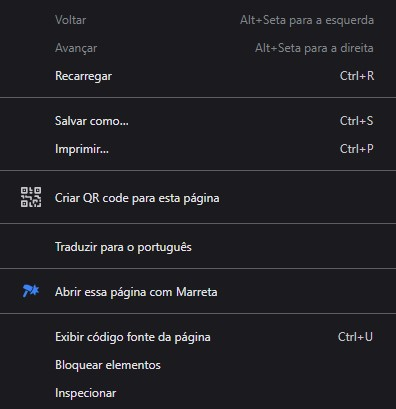

# Marreta: extensão de navegador

Acesse facilmente o [Marreta](https://marreta.pcdomanual.com/), a partir da página ou abra links com ele.

## Capturas de tela

### Menu de contexto

## Instalação

### Chromium

- Faça o download do arquivo.
- Extraia o arquivo ZIP.
- Abra o navegador e vá para `chrome://extensions`.
- Ative o "Modo Desenvolvedor" (localizado no canto superior direito).
- Clique no botão "Carregar sem compactação" (localizado no canto superior esquerdo).
- Navegue até o diretório onde você extraiu o arquivo ZIP contendo a extensão.
- Selecione a pasta da extensão.
