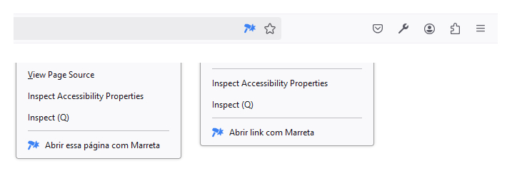
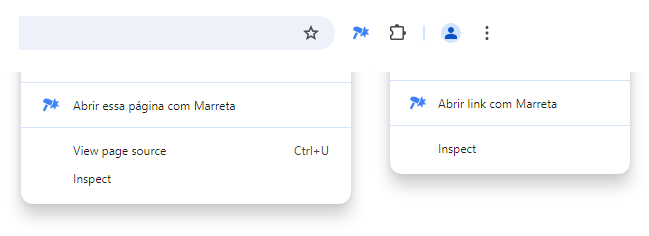

#  Extensão de Navegador do Marreta

[](https://addons.mozilla.org/en-US/firefox/addon/marreta) [](https://chrome.google.com/webstore/detail/marreta/ipelapagohjgjcgpncpbmaaacemafppe)

Use facilmente o [Marreta](https://marreta.pcdomanual.com/).

Com o botão direito do mouse acesse o conteúdo da página atual ou de um link específico. Pela barra de ferramentas (após fixar a extensão), acesse diretamente o conteúdo da página clicando no ícone. A extensão abre uma nova aba para acesso de link.

## Firefox



### Versão mínima suportada

- Desktop - Firefox, ESR, Beta, Developer Edition e Nightly: 115.0
- Mobile - Firefox, Firefox Android Beta, Firefox Android Nightly: 133.0

### Firefox Add-ons

[](https://addons.mozilla.org/en-US/firefox/addon/marreta/)

[](https://addons.mozilla.org/en-US/android/addon/marreta/)

### Arquivos XPI ou ZIP

- Faça o download da última versão dos arquivos [`marreta-firefox.xpi`](https://github.com/manualdousuario/marreta-extensao/releases) ou [`marreta-firefox.zip`](https://github.com/manualdousuario/marreta-extensao/releases).
- Abra o Firefox e navegue até `about:addons`.
- No ícone de engrenagem das configurações, clique em "Instalar de um arquivo..." (localizado no canto superior direito).
- Selecione o arquivo XPI ou ZIP da extensão.
- Fixar na barra de ferramentas.
- Na página de detalhes da extensão, pode ser necessário permitir a opção "Funcionamento em sites com restrições".

> [!NOTE]
> Instalação via arquivo ZIP só é permitida nas versões Firefox Extended Support Release (ESR), Firefox Developer Edition e Nightly. [Saiba mais](https://support.mozilla.org/pt-BR/kb/assinatura-de-extensoes-do-firefox#w_quais-sao-minhas-opcoes-se-eu-quiser-usar-uma-extensao-nao-assinada-usuarios-avancados).

## Chromium



### Chrome Web Store

[](https://chrome.google.com/webstore/detail/marreta/ipelapagohjgjcgpncpbmaaacemafppe)

### Arquivo ZIP

Instalação em navegadores baseados no Chromium.

- Faça o download da última versão do arquivo [`marreta-chromium.zip`](https://github.com/manualdousuario/marreta-extensao/releases).
- Extraia o arquivo ZIP.
- Abra o navegador e vá para `chrome://extensions`.
- Ative o "Modo Desenvolvedor" (localizado no canto superior direito).
- Clique no botão "Carregar sem compactação" (localizado no canto superior esquerdo).
- Navegue até o diretório onde você extraiu o arquivo ZIP contendo a extensão.
- Selecione a pasta da extensão.
- Fixar na barra de ferramentas.

## Desenvolvimento

### Pré-requisitos

- Node.js 20+
- yarn 4.5+

### Instalação

```bash
git clone git@github.com:manualdousuario/marreta-extensao.git
```

```bash
cd marreta-extensao
```

```bash
yarn install
```

### Ícones

Copiar os ícones para os diretórios de cada versão (Chromium e Firefox).

```bash
yarn icon
```

### Firefox for Android

[Configure seu computador e o emulador ou dispositivo Android](https://extensionworkshop.com/documentation/develop/developing-extensions-for-firefox-for-android/).

Em seguida, execute:

$ `cd firefox`

Para testar no Firefox Nightly:

$ `web-ext run -t firefox-android --adb-device <CODE> --firefox-apk org.mozilla.fenix`

Para testar no Firefox Beta:

$ `web-ext run -t firefox-android --adb-device <CODE> --firefox-apk org.mozilla.firefox_beta`

### Build

Compactar os arquivo.

```bash
yarn build
```

## Roadmap

- Página de configurações
    - Lista customizada para acesso automático
    - Target dos links e páginas (atualiza aba ou nova aba)
- <s>Suporte para o Firefox Android</s>
- i18
